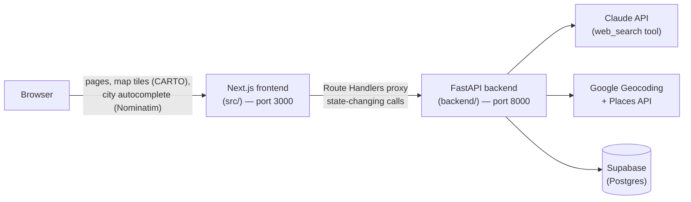
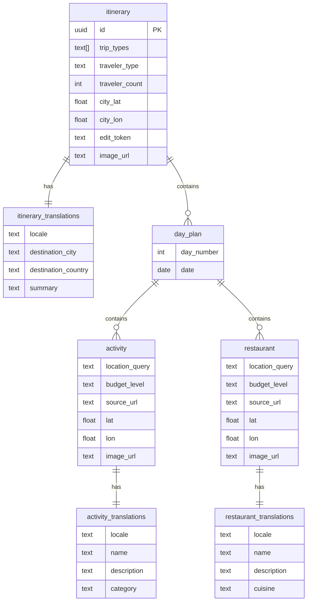

# Travel Agent

[](https://nextjs.org/)
[](https://react.dev/)
[](https://www.typescriptlang.org/)
[](https://fastapi.tiangolo.com/)
[](https://www.python.org/)
[](https://supabase.com/)
[](LICENSE)

**Travel Agent** turns "a city, some dates, and who's going" into a full day-by-day trip itinerary — real activities and restaurants, real GPS coordinates, real photos, all backed by live web search instead of invented facts. Every trip gets a permanent, shareable link and can be edited afterwards: regenerate the whole plan, or just the parts you don't like, without losing the rest.

Bilingual out of the box (French/English) — both the UI chrome and the AI-generated content itself.

---

## Table of contents

- [Features](#features)
- [Architecture](#architecture)
- [Tech stack](#tech-stack)
- [Getting started](#getting-started)
- [Environment variables](#environment-variables)
- [Project structure](#project-structure)
- [How it works](#how-it-works)
- [API reference](#api-reference)
- [Data model](#data-model)
- [Security](#security)
- [Deployment](#deployment)
- [Roadmap](#roadmap)
- [License](#license)

---

## Features

- **AI-generated itineraries** — describe a city, a date range and who's traveling; get back a day-by-day plan with activities, restaurants, realistic budgets (`free` / `€` / `€€` / `€€€`), durations, and a source link for every recommendation, produced with Claude's web search tool rather than hallucinated.
- **Interactive map** — every place is geocoded and plotted on a Leaflet map, filterable by day, synced two-way with the itinerary sidebar (click a pin, highlight the card; click a card, jump the map).
- **Real photos** — activities, restaurants and the destination itself get a cover photo pulled from Google Places, served through a backend proxy so no API key ever reaches the browser.
- **Edit after the fact** — from a trip's own page, regenerate the entire plan or just the checked items (a museum you don't like, one bad restaurant) — regeneration is scoped per day and enforces geographic and time-budget coherence with whatever you kept.
- **Permanent, shareable links** — every generated trip gets a stable `/{id}` URL and is listed in a searchable, filterable library (`/library`).
- **Bilingual (FR/EN)** — UI and AI-generated content (summary, activity/restaurant names & descriptions, destination) are both fully translated, with instant language switching.
- **No accounts, but not wide open** — no login system, but each trip carries a private "edit token" (HttpOnly cookie) so only its creator's browser can modify it, while the trip itself stays readable by anyone with the link.

## Architecture

Two independent projects in one repository, talking over HTTP — the frontend never calls Claude, Google, or Supabase directly.



- The **backend does all the business logic**: prompts Claude, geocodes places, fetches photos, persists everything, and handles regeneration. The frontend is thin — form, display, map — generation/regeneration logic never runs client-side.
- The map (Leaflet, CARTO tiles) is purely client-side; only already-geocoded coordinates ever cross the API boundary.
- The browser doesn't talk to FastAPI directly for anything that changes data — two Next.js Route Handlers (`src/app/api/itinerary/**`) proxy those calls server-side, which is also how the [edit-token](#security) cookie stays HttpOnly.

## Tech stack

| Layer | Stack |
|---|---|
| Frontend | Next.js 16 (App Router, Turbopack), React 19, TypeScript, Tailwind CSS v4, `date-fns`, `lucide-react`, `leaflet` / `react-leaflet` v5 |
| Backend | Python 3.12, FastAPI, Uvicorn, `anthropic` SDK, `httpx`, `pydantic` v2, `slowapi` (rate limiting) |
| Database | Supabase (Postgres), accessed via the official Python client / PostgREST |
| AI | Claude API — direct `messages` calls with the `web_search` server tool and structured JSON output (used for generation, translation, and both regeneration modes) |
| Geocoding & photos | Google Geocoding API + Google Places API (coordinates and cover photos) |
| Maps | Leaflet with CARTO Voyager tiles (free, no API key) |

> ⚠️ **This is a recent Next.js version with breaking changes.** `params` in dynamic pages is a `Promise`; the middleware convention is now `proxy.ts`, not `middleware.ts`. See [`node_modules/next/dist/docs/`](node_modules/next/dist/docs/) before touching non-trivial Next.js code, and [`CONTEXT.md`](CONTEXT.md) for the details this project already ran into.

## Getting started

### Prerequisites

- Node.js 20+, npm
- Python 3.12+
- A [Supabase](https://supabase.com/) project (Postgres)
- API keys: [Anthropic](https://console.anthropic.com/) (Claude), [Google Cloud](https://console.cloud.google.com/) with **Geocoding API** + **Places API** enabled and billing active

### Backend

```bash
cd backend
python3 -m venv .venv
source .venv/bin/activate
pip install -r requirements.txt
cp .env.example .env   # then fill in the values, see below
uvicorn app.main:app --reload --port 8000
```

### Frontend

```bash
# from the repo root
cp .env.local.example .env.local   # then fill in the values, see below
npm install
npm run dev
```

Open **http://localhost:3000**. The backend exposes interactive API docs at **http://localhost:8000/docs** (Swagger UI — lets you exercise every route, including regeneration, without going through the form).

> Generating a real itinerary costs a Claude call plus several Google API calls and can take anywhere from ~30 seconds to a few minutes. For quick end-to-end testing, query Supabase directly (with the `service_role` key) for an existing itinerary `id` instead of generating a new one every time.

## Environment variables

**`backend/.env`** (never committed):

| Variable | Required | Description |
|---|---|---|
| `ANTHROPIC_API_KEY` | ✅ | Claude API key |
| `GOOGLE_LOCATION_API_KEY` | ✅ | Google Cloud key with Geocoding API + Places API enabled, billing on, and **no** HTTP-referrer restriction (must work server-side) |
| `SUPABASE_URL` | ✅ | Supabase project URL, **without** trailing `/rest/v1/` |
| `SUPABASE_SERVICE_ROLE_KEY` | ✅ | The `service_role` (secret) key — not the public/anon key |
| `CLAUDE_MODEL` | – | Defaults to `claude-haiku-4-5` |
| `CORS_ALLOW_ORIGINS` | – | Defaults to `["http://localhost:3000"]` |
| `API_BASE_URL` | – | This server's own public URL, used to build `/api/photo/...` links — set to the deployed backend URL in production |
| `THREAD_POOL_SIZE` | – | Defaults to `100` — worker-thread cap for the (long-running) generation/regeneration routes |

**`.env.local`** (repo root, frontend):

| Variable | Required | Description |
|---|---|---|
| `NEXT_PUBLIC_API_URL` | ✅ | Base URL of the FastAPI backend, e.g. `http://localhost:8000` |

## Project structure

```
travel-agent/
├── src/                        # Next.js frontend (App Router)
│   ├── app/                    # Routes: "/", "/library", "/[id]", api proxy routes
│   ├── components/
│   │   ├── travel-form/        # Multi-step form, trip detail page (map + sidebar), Leaflet map
│   │   ├── library/            # Search/filter browser for saved trips
│   │   └── common/             # Language toggle
│   ├── lib/i18n/                # UI + cookie-based locale system
│   └── proxy.ts                 # CSP / security headers (Next 16's "proxy", formerly middleware.ts)
│
├── backend/                    # FastAPI backend (independent Python project)
│   ├── app/
│   │   ├── api/routes/          # itinerary.py, photo.py
│   │   ├── core/                 # config, rate limiter, log redaction
│   │   ├── schemas/              # Pydantic models (request/response/DB/regeneration)
│   │   └── services/             # itinerary_agent.py (Claude/geocoding/photos), storage.py (Supabase)
│   ├── scripts/                  # One-off maintenance scripts
│   └── Dockerfile
│
└── CONTEXT.md                  # Deep, exhaustive project reference (see below)
```

This README covers the "why" and "how to run it." For an exhaustive, file-by-file breakdown of every component, data flow, and the reasoning behind non-obvious decisions, see **[`CONTEXT.md`](CONTEXT.md)** — it's written to let a new contributor (human or AI) get fully up to speed without re-deriving anything from the code.

## How it works

### Generation

1. A 3-step form collects the city, date range, traveler profile, and desired "vibes."
2. The frontend proxies the request to the backend, which builds a detailed prompt (one entry per day, geographic-proximity rules, realistic budgets, mandatory source URLs) and calls Claude with the `web_search` tool and a structured JSON schema — generation always happens in French internally.
3. Every place gets geocoded (Google Geocoding/Places — Claude is explicitly forbidden from inventing coordinates) and, where available, a cover photo.
4. The result is translated to English in a second, search-free Claude call, and both languages are persisted to Supabase in one shot.
5. The trip redirects to its permanent `/{id}` page.

### Editing & regeneration

From a trip's page, toggling "edit mode" lets you check/uncheck individual activities and restaurants:

- **Everything checked** → full regeneration (same prompt as creation, brand-new plan).
- **Some checked** → partial regeneration, scoped **per affected day only**: Claude is told what you're keeping (so the new suggestions stay in the same area and fit the remaining time budget) and asked for exactly as many replacements as were unchecked.

Regeneration always **updates the trip in place** — the `/{id}` URL never changes.

### Internationalization

Two independent layers: static UI strings (a dictionary-based `t()`/`tList()` system) and AI-generated content, which is translated once at generation time and stored per-language in dedicated `*_translations` tables — never recomputed on read. The active locale lives in a cookie (not `localStorage`), because Server Components need to know it *before* the first render to request the right language from the API.

## API reference

Full interactive documentation lives at `/docs` (Swagger) on the running backend. Summary:

| Method | Route | Description |
|---|---|---|
| `POST` | `/api/itinerary?lang=` | Generate a new itinerary. Rate-limited (`5/min`, `20/hour` per IP). Returns an `edit_token` once. |
| `GET` | `/api/itinerary?lang=` | List all saved trips (used by `/library`). |
| `GET` | `/api/itinerary/{id}?lang=` | Fetch one trip. Accepts `X-Edit-Token`; returns `can_edit`. |
| `POST` | `/api/itinerary/{id}/regenerate?lang=` | Regenerate all or selected items (`itemKeys`). Requires a valid `X-Edit-Token` (403 otherwise). |
| `GET` | `/api/photo/{photo_reference}` | Server-side proxy for Google Places photos. Rate-limited (`60/min` per IP). |
| `GET` | `/health` | Liveness check — depends on nothing external. |

## Data model



All free-text content (names, descriptions, summaries, destination) lives exclusively in the `*_translations` tables, one row per locale — the base tables carry only structural data. Foreign keys cascade on delete, so removing a `day_plan` cleans up every dependent activity/restaurant/translation automatically. No Row Level Security: access control is intentionally handled at the application layer instead (see [Security](#security)).

## Security

- **No user accounts** — instead, every trip gets a random `edit_token` on creation, returned once and stored as an **HttpOnly** cookie (set server-side by a Next.js Route Handler, never by client JS). Only the browser holding that cookie can regenerate a trip; anyone with the link can still read it.
- **API keys never reach the client** — Google Places photo URLs are never stored or served raw; the backend fetches the image bytes itself and streams them through `/api/photo/{reference}`, which only relays references that are actually referenced in the database (no open, unauthenticated proxy).
- **Content-Security-Policy** with a per-request nonce and `strict-dynamic` for scripts, plus `X-Frame-Options`, `Referrer-Policy`, and a locked-down `Permissions-Policy` — set on every response via `src/proxy.ts`.
- **Rate limiting** (`slowapi`) on the expensive/abusable routes: trip generation (paid Claude + Google calls) and the photo proxy.
- **`noindex`** — trips are link-shareable, not meant to be publicly discoverable; `robots.txt` disallows everything.

## Deployment

- **Backend** → Google Cloud Run, built from `backend/Dockerfile`.
- **Frontend** → Vercel, with `NEXT_PUBLIC_API_URL` pointed at the deployed backend.

## Roadmap

The current agent generates a solid first draft of a trip and lets you patch it up afterwards. The next wave of work is less about infrastructure and more about making the agent itself smarter and the product more useful day-to-day:

- [ ] **Route-aware planning** — sequence each day's activities by actual travel time between stops (walking/transit), not just rough geographic proximity
- [ ] **Conversational refinement** — "make day 3 more relaxed," "swap lunch for something cheaper" as free-text instructions instead of only checkbox-based regeneration
- [ ] **Multi-city trips** — plan a single trip across several cities, choosing how many days to spend in each, with the agent handling transitions between legs
- [ ] **Whole-trip budget awareness** — let the agent balance spend across the full trip instead of judging each activity/restaurant in isolation
- [ ] **Weather-aware suggestions** — swap outdoor activities for indoor alternatives when the forecast calls for it
- [ ] **Richer place data** — multiple photos per place, opening hours, and booking/ticket links alongside the source URL
- [ ] **Personalization** — learn from a user's past trips and edits to bias future generations toward their actual taste
- [ ] **Real accounts** — move beyond the per-trip edit token toward saved trips, favorites, and collaborative editing between multiple people

## License

MIT — see [LICENSE](LICENSE).
